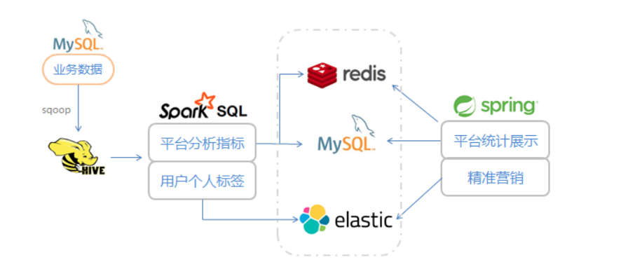

# Personal
### 电商用户画像

#### 数据用Sqoop从Mysql中导入到Hive， 使用Spark作为分析引擎，用sparkSQL对定义的指标进行计算，得到结果写入外部存储系统

#### 数据用于展示和精准营销
#### 平台统计指标展示（echart.js）; 统计结果数据写入redis(或mysql)；后台应用服务获取数据传给前端进行页面绘制；
#### 用户标签精准营销； 全部标签在页面上分类显示，点选标签进行圈人；生成对应的用户列表，用于精准营销推送活动消息；

